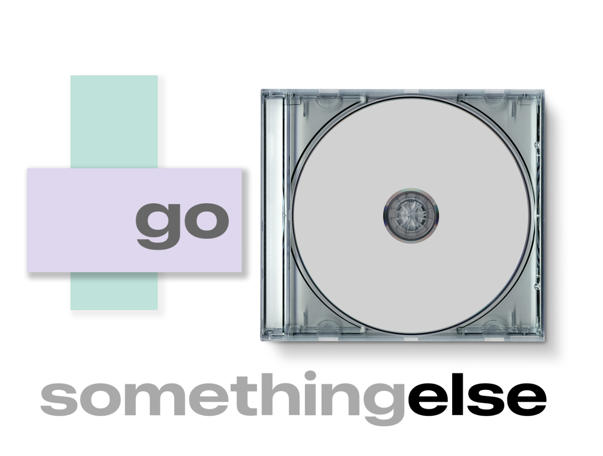
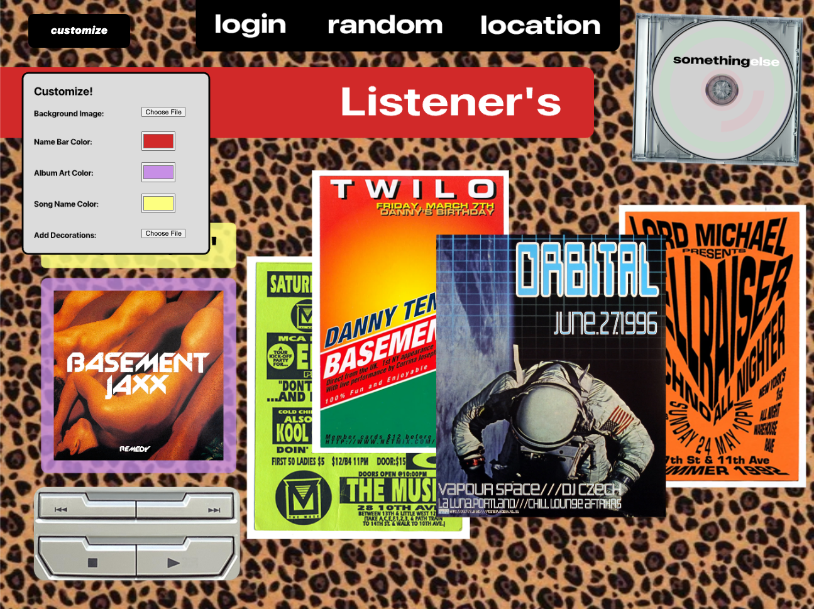

# somethingelse

somethingelse was created for my masters thesis for the [IDM program at the NYU Tandon School of Engineering.](https://idm.engineering.nyu.edu)

  <table>
    <tr>
      <td><kbd></kbd></td>
      <td><kbd></kbd></td>
    </tr>
    <tr>
      <td colspan="2" align="center"><kbd></kbd></td>
    </tr>
  </table>

## Description

somethingelse is a concept I developed pushing back against the control that third party platforms have over artists promotion and development. Inspired by the diversity and creativity of musicians' websites of the late 1990s and 2000s as well as rave poster culture, I created a quasi platform that allows musicians to present and promote their work in a very visual way. Artists can upload an image promoting work or a live performance, a song, and a short description. Fans can browse and view these artist created pages, saving them for viewing later, or interact with them immediately. Part MySpace, part interactive posters; I created something that encourages experimentation and a return to the more fun side of the internet. What if we could stop just looking at lists of content and end the doomscroll? somethingelse is a step in that direction.

I experimented with using LLM/AI dev tools for this project and used Claude Sonnet 4.5 (Anthropic 2025) for coding assistance.

Please visit [Lousansano.com](https://lousansano.com) for photos of the installation and more information.

## NOTE

Most of the content on somethingelse (artist posters, music) is not original content, and is intended only for academic and research purposes.

Copyrighted music has been removed from the project for the purposes of this demo. Placeholder music will be uploaded later.

### Built with

- p5.js
- JavaScript

## Acknowledgements

My thesis advisor Alex Nathanson for guidance and support.

Noah Lemen, Tate Gregor, and Charlie Kaplowitz, for helping to inspire this project.