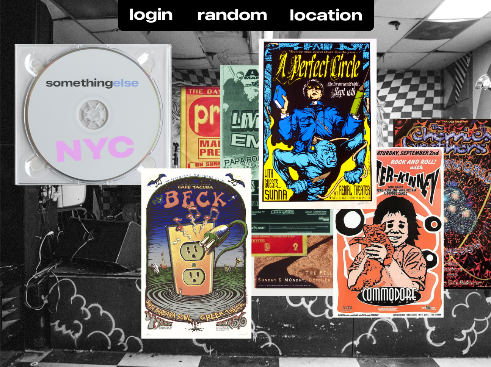

# somethingelse

somethingelse was created for my masters thesis for the [IDM program at the NYU Tandon School of Engineering.](https://idm.engineering.nyu.edu)

  <kbd>
    
  </kbd>

## Description

somethingelse is a concept I developed pushing back against the control that third party platforms have over artists promotion and development. Inspired by the diversity and creativity of musicians' websites of the late 1990s and 2000s as well as rave poster culture, I created a quasi platform that allows musicians to present and promote their work in a very visual way. Artists can upload an image promoting work or a live performance, a song, and a short description. Fans can browse and view these artist created pages, saving them for viewing later, or interact with them directly via comments. Part MySpace, part interactive posters; I created something that encourages experimentation and a return to the more fun side of the internet. What if we could stop just looking at lists of content and attempt to end the doomscroll? Somethingelse is a step in that direction.

### Built with

- p5.js
- JavaScript

## Acknowledgements

Thanks to Noah Lemen, Tate Gregor, Charlie Kaplowitz, and Alex Nathanson for helping to inspire and develop this project

## NOTE

 Most of the content on somethingelse (artist posters, music) is not original content, and is intended only for academic and research purposes.